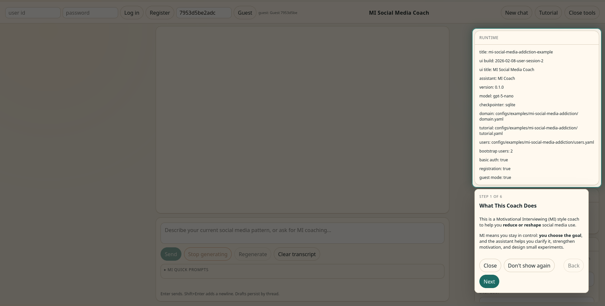
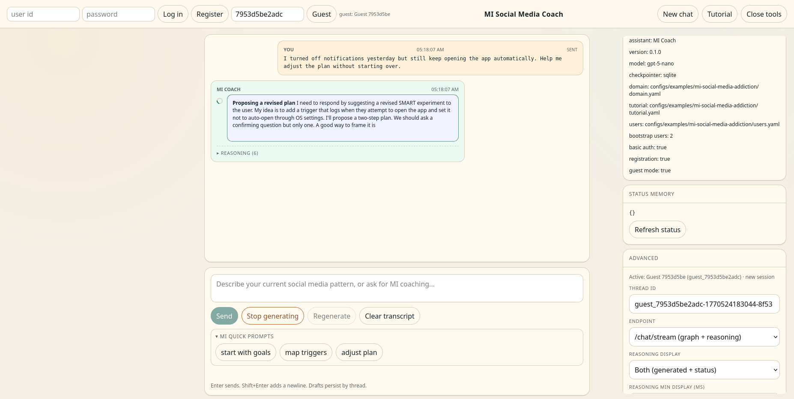
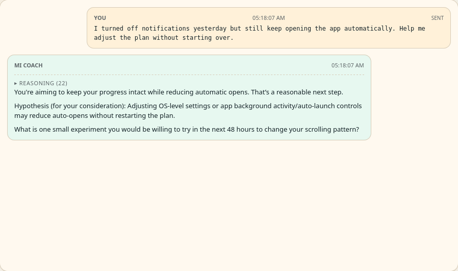

# clab

This repository provides a practical scaffold for building LangGraph-based agents that automate **conversational labour** grounded in codified expertise.

The core idea:
- Reuse the app architecture and skills in this repo.
- Supply your domain theory/tutorial/users configuration.
- Run a chatbot interface that executes structured conversational action.

## What This Is For

Use this when you want an agent to create change in users through conversation, such as:
- coaching
- tutoring
- interviewing
- structured facilitation and behavior-change support

The agent here is intentionally focused on conversational action. It is not a general autonomous tool-use agent.

## Project Status And Research Context

The apps in this repository have **not been user-tested as a packaged product**.

They are a generalization of patterns used in prior research prototypes, including:
- Göldi, Andreas and Rietsche, Roman, "Chatbot Agents Displaying Non-factive Reasoning Enhance Expectation Confirmation" (2024). *ICIS 2024 Proceedings*. 8. https://aisel.aisnet.org/icis2024/humtechinter/humtechinter/8
- Andreas Göldi, Roman Rietsche, and Lyle Ungar. 2025. "Efficient Management of LLM-Based Coaching Agents' Reasoning While Maintaining Interaction Quality and Speed." In *Proceedings of the 2025 CHI Conference on Human Factors in Computing Systems (CHI '25)*. Association for Computing Machinery, New York, NY, USA, Article 992, 1-18. https://doi.org/10.1145/3706598.3713606

## Quick Start

Default app in this repo is the haiku tutor example.

```bash
export OPENAI_API_KEY=...
docker compose up --build -d
```

Open:
- `http://127.0.0.1:8000/ui/`
- `http://127.0.0.1:8000/meta`

For full technical setup (local run, env vars, auth/session flows, endpoints, smoke tests, and app cloning), see `SETUP.md`.

## Run The MI Example App

```bash
export OPENAI_API_KEY=...
export CLAB_APP_MODULE=mi_social_media_addiction_example.server:app
export CLAB_DOMAIN_PATH=configs/examples/mi-social-media-addiction/domain.yaml
export CLAB_TUTORIAL_PATH=configs/examples/mi-social-media-addiction/tutorial.yaml
export CLAB_USERS_PATH=configs/examples/mi-social-media-addiction/users.yaml
docker compose up --build -d
```

## Create A New App (Fast Path)

Clone the working architecture and adapt only domain content:

```bash
python scripts/create_app_from_example.py <app-id>
```

Then set:
- `CLAB_APP_MODULE`
- `CLAB_DOMAIN_PATH`
- `CLAB_TUTORIAL_PATH`
- `CLAB_USERS_PATH`

and run via Docker or local uvicorn.

A reusable prompt template is available in `SETUP.md` under "Prompt For Creating A New App".

## MI App Screenshots







## Skills Included

- `langgraph-conversational-labour`: scaffold and app-cloning workflow
- `add-fastapi-chat-ui`: lightweight browser chat UI with reasoning/status inspection

See `AGENTS.md` for skill usage guidance in this repo.
